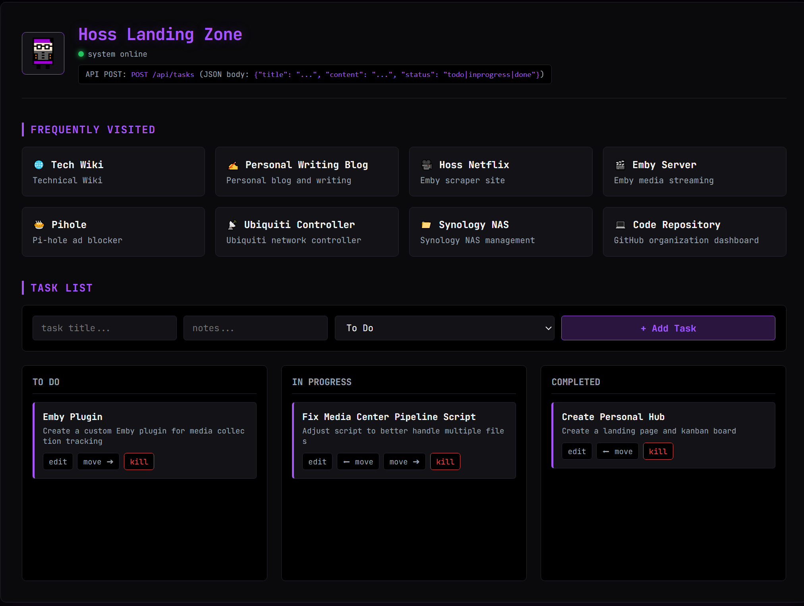

# Personal Hub & Dashboard
## Preview

## Description
A lightweight, terminal-inspired personal dashboard and Kanban task manager built with Node.js, Express, SQLite, Alpine.js, and a custom retro dark theme. Designed to run locally via Docker for fast task tracking and quick access to favorite links. I built this mainly as a way for me to practice making a simple API and to play around with more containerization.
## Features
* **Kanban Task Board:** Manage tasks across **To Do**, **In Progress**, and **Completed** columns with bidirectional movement (`move`, `edit`, and `delete`).
* **REST API:** Lightweight API endpoints to programmatically manage tasks via external scripts or mobile shortcuts.
* **Persistent Storage:** Safely tracks data using SQLite mapped to a local host directory via Docker volumes.
* **Retro Terminal Aesthetic:** Clean, distraction-free monospace styling optimized for a custom browser landing page.
## Project Structure
```text
personal-hub-site/
├── data/                    # Persistent storage (Ignored by Git)
├── src/
│   ├── db.js                # SQLite database initialization & tracking
│   ├── routes.js            # REST API endpoints & server routing
│   ├── views/
│   │   ├── dashboard.js     # Main frontend layout & Alpine.js components
│   │   └── dashboard.example.js # Sanitized template version for public repos
│   └── server.js            # Main application entry point
├── Dockerfile               # Container configuration
├── docker-compose.yml       # Docker orchestration & volume mapping
├── package.json             # Project dependencies
└── .gitignore               # Files excluded from version control
```
## Getting Started
### Prerequisites
* [Docker](https://www.docker.com/) and Docker Compose installed on your system.
### Installation & Setup
1. **Clone the repository:**
   ```bash
   git clone [https://github.com/caleb-stults/personal-hub-site.git](https://github.com/caleb-stults/personal-hub-site.git)
   cd your-repo-name
   ```
2. **Configure your dashboard:**
   Copy the example dashboard template to create your active view file:
   ```bash
   cp src/views/dashboard.example.js src/views/dashboard.js
   ```
   (Open src/views/dashboard.js to customize your links, internal IPs, or bookmarks).
3. **Build and run with Docker Compose:**
```bash
docker compose up --build -d
```
4. **Access the Dashboard:**
Open your browser and navigate to:
```text
http://localhost:3000
```